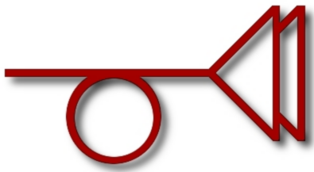

> What did she so desire escape from? Such a captive maiden, having plenty of
> time to think, soon realizes that her tower, its height and architecture, are
> like her ego only incidental: that what really keeps her where she is is
> magic, anonymous and malignant, visited on her from outside and for no reason
> at all. Having no apparatus except gut fear and female cunning to examine this
> formless magic, to understand how it works, how to measure its field strength,
> count its lines of force, she may fall back on superstition, or take up a
> useful hobby like embroidery, or go mad, or marry a disk jockey. If the tower
> is everywhere and the knight of deliverance no proof against its magic, what
> else?
>
> — Thomas Pynchon, *The Crying of Lot 49*

# trystero



A local integration canary for the circuits substrate. It depends on every
substrate package and runs a single executable, `trystero-green-lights`, that
imports one representative module from each package and prints a green line per
package. If the canary builds, the whole substrate compiles and links together.

```bash
cd ~/haskell/trystero
cabal build all
cabal run trystero-green-lights
```

## Dashboard

CI status, open issues/PRs, and Hackage presence for the 27 substrate packages.
The table is generated by `trystero-dashboard`.

| Name | Issues | PRs | Status | Version | Hackage | Stackage |
| ---- | ------ | --- | ------ | ------- | ------- | -------- |
|[numhask](https://github.com/tonyday567/numhask) |[](https://github.com/tonyday567/numhask/issues) |[](https://github.com/tonyday567/numhask/pulls) |[](https://github.com/tonyday567/numhask/actions/workflows/haskell-ci.yml) |0.14.0.0 |[](https://hackage.haskell.org/package/numhask) |[](https://www.stackage.org/package/numhask) [](https://www.stackage.org/package/numhask)|
|[numhask-space](https://github.com/tonyday567/numhask-space) |[](https://github.com/tonyday567/numhask-space/issues) |[](https://github.com/tonyday567/numhask-space/pulls) |[](https://github.com/tonyday567/numhask-space/actions/workflows/haskell-ci.yml) |0.13.3.0 |[](https://hackage.haskell.org/package/numhask-space) |[](https://www.stackage.org/package/numhask-space) [](https://www.stackage.org/package/numhask-space)|
|[harpie](https://github.com/tonyday567/harpie) |[](https://github.com/tonyday567/harpie/issues) |[](https://github.com/tonyday567/harpie/pulls) |[](https://github.com/tonyday567/harpie/actions/workflows/haskell-ci.yml) |0.3.0.0 |[](https://hackage.haskell.org/package/harpie) |[](https://www.stackage.org/package/harpie) [](https://www.stackage.org/package/harpie)|
|[circuits](https://github.com/tonyday567/circuits) |[](https://github.com/tonyday567/circuits/issues) |[](https://github.com/tonyday567/circuits/pulls) |[](https://github.com/tonyday567/circuits/actions/workflows/haskell-ci.yml) |0.3.0.0 |[](https://hackage.haskell.org/package/circuits) ||
|[circuits-agent](https://github.com/tonyday567/circuits-agent) |[](https://github.com/tonyday567/circuits-agent/issues) |[](https://github.com/tonyday567/circuits-agent/pulls) |[](https://github.com/tonyday567/circuits-agent/actions/workflows/haskell-ci.yml) |0.1.0.0 | ||
|[circuits-chu](https://github.com/tonyday567/circuits-chu) |[](https://github.com/tonyday567/circuits-chu/issues) |[](https://github.com/tonyday567/circuits-chu/pulls) |[](https://github.com/tonyday567/circuits-chu/actions/workflows/haskell-ci.yml) |0.3.0.0 | ||
|[circuits-diagrams](https://github.com/tonyday567/circuits-diagrams) |[](https://github.com/tonyday567/circuits-diagrams/issues) |[](https://github.com/tonyday567/circuits-diagrams/pulls) |[](https://github.com/tonyday567/circuits-diagrams/actions/workflows/haskell-ci.yml) |0.1.0.0 | ||
|[circuits-diff](https://github.com/tonyday567/circuits-diff) |[](https://github.com/tonyday567/circuits-diff/issues) |[](https://github.com/tonyday567/circuits-diff/pulls) |[](https://github.com/tonyday567/circuits-diff/actions/workflows/haskell-ci.yml) |0.1.0.0 | ||
|[circuits-inference](https://github.com/tonyday567/circuits-inference) |[](https://github.com/tonyday567/circuits-inference/issues) |[](https://github.com/tonyday567/circuits-inference/pulls) |[](https://github.com/tonyday567/circuits-inference/actions/workflows/haskell-ci.yml) |0.1.0.0 | ||
|[circuits-learn](https://github.com/tonyday567/circuits-learn) |[](https://github.com/tonyday567/circuits-learn/issues) |[](https://github.com/tonyday567/circuits-learn/pulls) |[](https://github.com/tonyday567/circuits-learn/actions/workflows/haskell-ci.yml) |0.1.0.0 | ||
|[circuits-llm](https://github.com/tonyday567/circuits-llm) |[](https://github.com/tonyday567/circuits-llm/issues) |[](https://github.com/tonyday567/circuits-llm/pulls) |[](https://github.com/tonyday567/circuits-llm/actions/workflows/haskell-ci.yml) |0.1.0.0 | ||
|[circuits-log](https://github.com/tonyday567/circuits-log) |[](https://github.com/tonyday567/circuits-log/issues) |[](https://github.com/tonyday567/circuits-log/pulls) |[](https://github.com/tonyday567/circuits-log/actions/workflows/haskell-ci.yml) |0.1.0.0 | ||
|[circuits-mat](https://github.com/tonyday567/circuits-mat) |[](https://github.com/tonyday567/circuits-mat/issues) |[](https://github.com/tonyday567/circuits-mat/pulls) |[](https://github.com/tonyday567/circuits-mat/actions/workflows/haskell-ci.yml) |0.1.0.0 | ||
|[circuits-meter](https://github.com/tonyday567/circuits-meter) |[](https://github.com/tonyday567/circuits-meter/issues) |[](https://github.com/tonyday567/circuits-meter/pulls) |[](https://github.com/tonyday567/circuits-meter/actions/workflows/haskell-ci.yml) |0.1.0.0 | ||
|[circuits-parser](https://github.com/tonyday567/circuits-parser) |[](https://github.com/tonyday567/circuits-parser/issues) |[](https://github.com/tonyday567/circuits-parser/pulls) |[](https://github.com/tonyday567/circuits-parser/actions/workflows/haskell-ci.yml) |0.1.0.0 | ||
|[circuits-pca](https://github.com/tonyday567/circuits-pca) |[](https://github.com/tonyday567/circuits-pca/issues) |[](https://github.com/tonyday567/circuits-pca/pulls) |[](https://github.com/tonyday567/circuits-pca/actions/workflows/haskell-ci.yml) |0.1.0.0 | ||
|[circuits-rl](https://github.com/tonyday567/circuits-rl) |[](https://github.com/tonyday567/circuits-rl/issues) |[](https://github.com/tonyday567/circuits-rl/pulls) |[](https://github.com/tonyday567/circuits-rl/actions/workflows/haskell-ci.yml) |0.1.0.0 | ||
|[circuits-stats](https://github.com/tonyday567/circuits-stats) |[](https://github.com/tonyday567/circuits-stats/issues) |[](https://github.com/tonyday567/circuits-stats/pulls) |[](https://github.com/tonyday567/circuits-stats/actions/workflows/haskell-ci.yml) |0.1.0.0 | ||
|[trystero](https://github.com/tonyday567/trystero) |[](https://github.com/tonyday567/trystero/issues) |[](https://github.com/tonyday567/trystero/pulls) |[](https://github.com/tonyday567/trystero/actions/workflows/haskell-ci.yml) |0.1.0.0 | ||
|[chart-svg](https://github.com/tonyday567/chart-svg) |[](https://github.com/tonyday567/chart-svg/issues) |[](https://github.com/tonyday567/chart-svg/pulls) |[](https://github.com/tonyday567/chart-svg/actions/workflows/haskell-ci.yml) |0.8.4.0 |[](https://hackage.haskell.org/package/chart-svg) |[](https://www.stackage.org/package/chart-svg) [](https://www.stackage.org/package/chart-svg)|
|[formatn](https://github.com/tonyday567/formatn) |[](https://github.com/tonyday567/formatn/issues) |[](https://github.com/tonyday567/formatn/pulls) |[](https://github.com/tonyday567/formatn/actions/workflows/haskell-ci.yml) |0.3.4.0 |[](https://hackage.haskell.org/package/formatn) |[](https://www.stackage.org/package/formatn) [](https://www.stackage.org/package/formatn)|
|[manyvalued](https://github.com/tonyday567/manyvalued) |[](https://github.com/tonyday567/manyvalued/issues) |[](https://github.com/tonyday567/manyvalued/pulls) |[](https://github.com/tonyday567/manyvalued/actions/workflows/haskell-ci.yml) |0.1.0.0 | ||
|[markup-parse](https://github.com/tonyday567/markup-parse) |[](https://github.com/tonyday567/markup-parse/issues) |[](https://github.com/tonyday567/markup-parse/pulls) |[](https://github.com/tonyday567/markup-parse/actions/workflows/haskell-ci.yml) |0.3.0.0 |[](https://hackage.haskell.org/package/markup-parse) |[](https://www.stackage.org/package/markup-parse) [](https://www.stackage.org/package/markup-parse)|
|[mnet](https://github.com/tonyday567/mnet) |[](https://github.com/tonyday567/mnet/issues) |[](https://github.com/tonyday567/mnet/pulls) |[](https://github.com/tonyday567/mnet/actions/workflows/haskell-ci.yml) |0.1.0.0 | ||
|[prettychart](https://github.com/tonyday567/prettychart) |[](https://github.com/tonyday567/prettychart/issues) |[](https://github.com/tonyday567/prettychart/pulls) |[](https://github.com/tonyday567/prettychart/actions/workflows/haskell-ci.yml) |0.4.0.0 |[](https://hackage.haskell.org/package/prettychart) |[](https://www.stackage.org/package/prettychart) [](https://www.stackage.org/package/prettychart)|
|[sysl](https://github.com/tonyday567/sysl) |[](https://github.com/tonyday567/sysl/issues) |[](https://github.com/tonyday567/sysl/pulls) |[](https://github.com/tonyday567/sysl/actions/workflows/haskell-ci.yml) |0.1.0.0 | ||
|[free-agent](https://github.com/tonyday567/free-agent) |[](https://github.com/tonyday567/free-agent/issues) |[](https://github.com/tonyday567/free-agent/pulls) |[](https://github.com/tonyday567/free-agent/actions/workflows/haskell-ci.yml) |0.1.0.0 | ||

The authoritative dependency graph is `cabal.project` (which packages are in
scope) plus the library `build-depends` in `trystero.cabal` (which
the canary links against). The `Trystero` module is the smoke test: one
import per package.

## CI

All 27 substrate repos carry `.github/workflows/haskell-ci.yml`. The dashboard
above shows the live CI badge for each package.

### Default workflow

`numhask-space` is the reference template (`.github/workflows/haskell-ci.yml`):

- `hlint` — `fail-on: warning`.
- `ormolu` — `haskell-actions/run-ormolu@v17`, pinned to 0.8.1.1.
- `build` — GHC 9.14 / 9.12 / 9.10 on ubuntu, plus 9.14 on windows and macos:
  configure, `cabal build all`, `cabal check`, then `cabal-docspec` on
  9.14/ubuntu.

### Variations from default

| repo | variation | why |
|---|---|---|
| `harpie` | extra `hmatrix bridge` job | manual `flag hmatrix` switches in the BLAS/LAPACK compute backend; the job installs `libblas-dev liblapack-dev` and builds with `--flag hmatrix` |
| `formatn`, `numhask` | ormolu stubbed | ormolu version-mismatch history |
| `chart-svg` | no `cabal-docspec` step | never added |
| `circuits-parser` | lint-only workflow (`name: lint`, no build) | minimal workflow, never grown to the full template |

### Known failure causes

- **sibling `../` refs in committed `cabal.project`** — the build matrix fails on
  CI's shallow clone because sibling dirs don't exist on the runner. The
  convention is a self-contained `cabal.project` with sibling deps moved to the
  gitignored `cabal.project.local`.
- **lint debt** — commits landing without running `ormolu`/`hlint` first.
- **doctest errors** — stale `>>>` examples across the substrate (missing
  imports, renamed constructors), being hunted down as of this snapshot.

## Adjacent external dependencies

One-step-away Hackage packages used by the substrate libraries. These are the
neighbours you are likely to bump into when working in any of the repos.

| package | used by | role |
|---|---|---|
| `profunctors` | `circuits`, `circuits-stats` | categorical plumbing |
| `stm` | `circuits` | channel-level concurrency |
| `adjunctions` | `numhask-space`, `harpie` | representable/functorial arrays |
| `distributive` | `numhask-space`, `harpie` | distributive functors |
| `semigroupoids` | `numhask-space` | semigroupoid instances |
| `first-class-families` | `harpie` | type-level computation |
| `vector` | `harpie`, `numhask-space`, `circuits-stats`, … | boxed/unboxed arrays |
| `vector-algorithms` | `harpie`, `circuits-stats` | sorting vectors |
| `containers` | `numhask`, `numhask-space`, `circuits-stats`, … | maps and sets |
| `text` | `numhask-space`, `circuits-stats`, `circuits-parser`, `circuits-llm` | text values |
| `bytestring` | `circuits-parser`, `circuits-llm` | byte streams |
| `time` | `numhask-space` | time types |
| `hmatrix` | `harpie`, `circuits-pca`, `circuits-llm` | BLAS-backed linear algebra |
| `random` | `harpie`, `circuits-llm` | random generation |
| `mwc-probability` | `numhask-space`, `circuits-stats` | probability distributions |
| `dunning-t-digest` | `numhask-space`, `circuits-stats` | approximate quantiles (t-digest) |
| `logict` | `circuits-parser` | backtracking parser logic |
| `mtl` | `circuits-parser` | monad transformers |
| `these` | `circuits-parser` | `These` result type |
| `process` | `circuits-parser` | spawning external processes |
| `prettyprinter` | `harpie`, `circuits-mat` | pretty-printing arrays |
| `primitive` | `circuits-stats` | primitive arrays / ST |
| `deepseq` | `circuits-parser`, `circuits-llm`, `circuits-meter` | strict NFData |
| `transformers` | `circuits-diff` | standard transformers |
| `ad-delcont` | `circuits-diff` | AD oracle reference |
| `clock` | `circuits-meter` | timing measurements |
| `optparse-applicative` | `circuits-meter` | CLI for observe executables |
| `tasty-bench` | `circuits-parser` | benchmarking harness |

## Verification and observation: the square

The substrate uses two complementary treatments for code that needs more than a
doctest:

```
        axiomatize  ↔  verify
              ↕
        machine     ↔  observe
```

| direction | treatment | stanza | main file | purpose |
|---|---|---|---|---|
| outward | **axiomatic verification** | `xyzzy-verify` | `app/verify.hs` | closed-form oracles, typeclass laws, exact checks |
| inward | **machine observation** | `xyzzy-observe` (separate package) | `app/observe.hs` | measurement, diagnosis, tolerance specification |

### Default: doctests as oracles

- In-source `>>>` examples are the first-class oracles.
- `cabal-docspec` runs them as the default hold-out verification and
development hook.
- A package should not have a `test/` directory just to wrap doctests.

### When you need more than a doctest

- **Axiomatic oracles** that need multiple dependencies or closed-form checks
  become an executable stanza `xyzzy-verify` with main file `app/verify.hs`.
- **Machine observation** that needs measurement dependencies becomes a
  *separate* package `xyzzy-observe` with main file `app/observe.hs`, so the
  core library stays clean for Stackage and does not carry measurement tools.
- Ask whether you are stating a **law** (`verify.hs`) or a **tolerance**
  (`observe.hs`). Explain either way.

### What is not in this pattern

- Benchmark comparisons against other libraries are measurement plumbing, not
  `observe.hs`. They live in separate benchmark or measurement scripts.
- `test-suite` stanzas that only shell out to `cabal-docspec` are glue, not a
  suite; remove them and call `cabal-docspec` directly in CI.
- No parallel test frameworks (tasty, Hspec, QuickCheck) without a written
  exception.

## External dependencies

| dependency | consumers | reason |
|---|---|---|
| `dunning-t-digest` | `numhask-space`, `circuits-stats` | maintained t-digest implementation with `base < 5`; replaced the unmaintained `tdigest` package |
