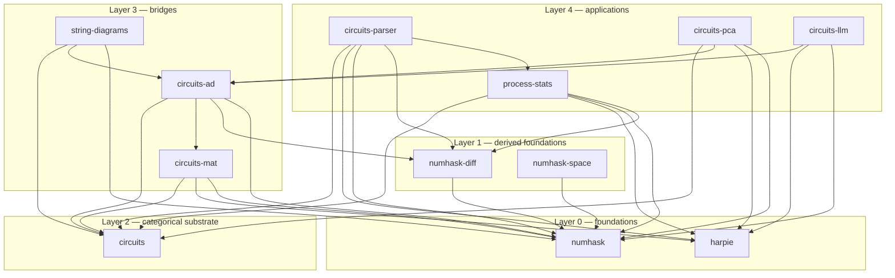

# substrate

A local integration canary for the circuits substrate. It depends on every
substrate package and runs a single executable, `substrate-green-lights`, that
imports one representative module from each package and prints a green line per
package. If the canary builds, the whole substrate compiles and links together.

```bash
cd ~/haskell/substrate
cabal run substrate-green-lights
```

## The 13 substrate packages

| # | package | family | representative module |
|---|---|---|---|
| 1 | `numhask` | algebraic | `NumHask.Prelude` |
| 2 | `numhask-diff` | algebraic | `NumHask.Diff` |
| 3 | `numhask-space` | algebraic | `NumHask.Space` |
| 4 | `harpie` | array | `Harpie.Array` |
| 5 | `circuits` | categorical | `Circuit.Process` |
| 7 | `circuits-ad` | categorical / AD | `Circuit.AD` |
| 8 | `circuits-mat` | bridge | `Circuit.Mat` |
| 9 | `string-diagrams` | bridge | `Circuit.PolyProcess` |
| 10 | `process-stats` | application | `Process.Stats` |
| 11 | `circuits-parser` | application | `Circuit.Parser` |
| 12 | `circuits-pca` | application | `Circuit.PCA` |
| 13 | `circuits-llm` | application | `Circuit.LLM.GPT` |

`circuits-meter` is also pointed at by `cabal.project` because `circuits-llm:bench`
depends on it, but it is not part of the green-lights check.

## Internal library dependencies



Arrows point from dependency to dependent. The diagram shows only direct
library-to-library edges inside the substrate; it omits the Hackage layer.

## Adjacent external dependencies

One-step-away Hackage packages used by the substrate libraries. These are the
neighbours you are likely to bump into when working in any of the repos.

| package | used by | role |
|---|---|---|
| `profunctors` | `circuits`, `process-stats` | categorical plumbing |
| `stm` | `circuits` | channel-level concurrency |
| `adjunctions` | `numhask-space`, `harpie` | representable/functorial arrays |
| `distributive` | `numhask-space`, `harpie` | distributive functors |
| `semigroupoids` | `numhask-space` | semigroupoid instances |
| `first-class-families` | `harpie` | type-level computation |
| `vector` | `harpie`, `numhask-space`, `process-stats`, … | boxed/unboxed arrays |
| `vector-algorithms` | `harpie`, `process-stats` | sorting vectors |
| `containers` | `numhask`, `numhask-space`, `process-stats`, … | maps and sets |
| `text` | `numhask-space`, `process-stats`, `circuits-parser`, `circuits-llm` | text values |
| `bytestring` | `circuits-parser`, `circuits-llm` | byte streams |
| `time` | `numhask-space` | time types |
| `hmatrix` | `harpie`, `circuits-pca`, `circuits-llm` | BLAS-backed linear algebra |
| `random` | `harpie`, `circuits-llm` | random generation |
| `mwc-probability` | `numhask-space`, `process-stats` | probability distributions |
| `dunning-t-digest` | `numhask-space`, `process-stats` | approximate quantiles (t-digest) |
| `logict` | `circuits-parser` | backtracking parser logic |
| `mtl` | `circuits-parser` | monad transformers |
| `these` | `circuits-parser` | `These` result type |
| `process` | `circuits-parser` | spawning external processes |
| `prettyprinter` | `harpie`, `circuits-mat` | pretty-printing arrays |
| `primitive` | `process-stats` | primitive arrays / ST |
| `deepseq` | `circuits-parser`, `circuits-llm`, `circuits-meter` | strict NFData |
| `transformers` | `circuits-ad` | standard transformers |
| `ad-delcont` | `circuits-ad` | AD oracle reference |
| `clock` | `circuits-meter` | timing measurements |
| `optparse-applicative` | `circuits-meter` | CLI for observe executables |
| `tasty-bench` | `circuits-parser` | benchmarking harness |

## Verification and observation: the square

The substrate uses two complementary treatments for code that needs more than a
doctest:

```
        axiomatize  ↔  verify
              ↕
        machine     ↔  observe
```

| direction | treatment | stanza | main file | purpose |
|---|---|---|---|---|
| outward | **axiomatic verification** | `xyzzy-verify` | `app/verify.hs` | closed-form oracles, typeclass laws, exact checks |
| inward | **machine observation** | `xyzzy-observe` (separate package) | `app/observe.hs` | measurement, diagnosis, tolerance specification |

### Default: doctests as oracles

- In-source `>>>` examples are the first-class oracles.
- `cabal-docspec` runs them as the default hold-out verification and
development hook.
- A package should not have a `test/` directory just to wrap doctests.

### When you need more than a doctest

- **Axiomatic oracles** that need multiple dependencies or closed-form checks
  become an executable stanza `xyzzy-verify` with main file `app/verify.hs`.
- **Machine observation** that needs measurement dependencies becomes a
  *separate* package `xyzzy-observe` with main file `app/observe.hs`, so the
  core library stays clean for Stackage and does not carry measurement tools.
- Ask whether you are stating a **law** (`verify.hs`) or a **tolerance**
  (`observe.hs`). Explain either way.

### What is not in this pattern

- Benchmark comparisons against other libraries are measurement plumbing, not
  `observe.hs`. They live in separate benchmark or measurement scripts.
- `test-suite` stanzas that only shell out to `cabal-docspec` are glue, not a
  suite; remove them and call `cabal-docspec` directly in CI.
- No parallel test frameworks (tasty, Hspec, QuickCheck) without a written
  exception.

## External dependencies

| dependency | consumers | reason |
|---|---|---|
| `dunning-t-digest` | `numhask-space`, `process-stats` | maintained t-digest implementation with `base < 5`; replaced the unmaintained `tdigest` package |

The `allow-newer: tdigest:base` workaround has been removed from
`cabal.project`.
